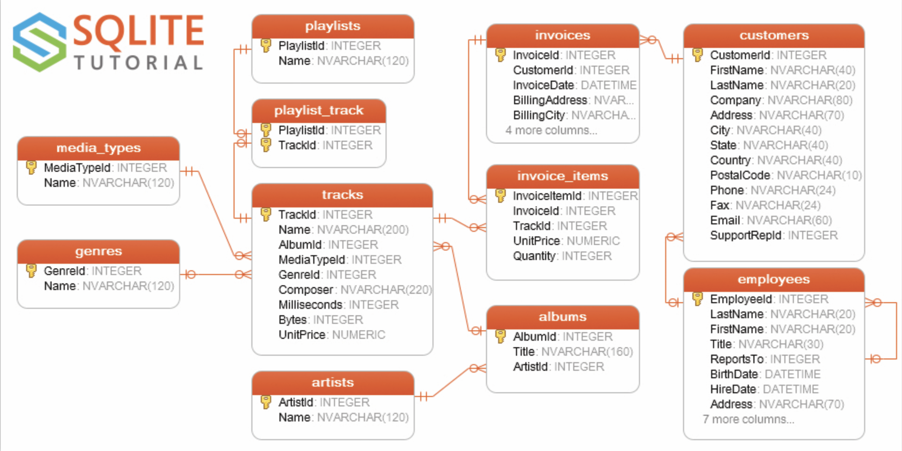

# Séance 1 : Les base de données

## 1. Théorie

### Qu’est-ce qu’une donnée ?
Pour ce cours : une information sous forme numérique

### Qu’est-ce qu’une base de données ?
Ecrire, trier, filtrer.

### Pourquoi utilise-t-on des bases de données?
Quelques applications possibles

### Les différents types de bases de données
- relationnelle
- document
- graphe

### Lecture / écriture : les langages de requêtes
- SQL
- noSQL
- Cypher
- OWL / triple store

## 2. Vocabulaire

### La logique client / serveur
Les échanges de données

### Tables, champ, encodage
Le stockage des données

### Formats de données
Chiffres, texte et date

### Définir un modèle
Comment décrire un livre?


## 3. Pratique : Lire une base de données existante

### SQLite
Une version légère de SQL

### Exemple: la base de données Chinook

Vous le trouverez dans le dossier [./chinook](./chinook)




###  Installer SQLite serveur

```
sudo apt-get update
sudo apt-get install sqlite3 libsqlite3-dev
```

### Lancer SQLite

```
sqlite3
```

### Quitter SQLite

> CTRL+C deux fois

### Ouvrir la base de données existantes

```
sqlite3 exemple/chinook.db
```

### Lister les tables

```
sqlite> .tables
albums          employees       invoices        playlists
artists         genres          media_types     tracks
customers       invoice_items   playlist_track
```

### Lister les attributs

```
.schema
```

### La structure d'une requête

Majuscules et point-virgules

## 4. Pratique : choisir et filtrer avec SELECT

### La commande SELECT

```
SELECT Name FROM tracks;
```

```
SELECT Name, composer FROM tracks;
```

```
SELECT * FROM tracks;
```

### Choisir une chanson

```
SELECT * FROM tracks WHERE Name = 'Carmen: Overture';
```

### Compter le nombre de chansons

```
SELECT COUNT(*) FROM Tracks;
```

### Lister toutes les villes (distinctes)

Comparer ces deux commandes
```
SELECT city FROM customers ORDER BY city;
```

```
SELECT DISTINCT city FROM customers;
```

### Ordonner les résultats

Comparer les deux requêtes

```
SELECT name, milliseconds, albumid FROM tracks ORDER BY albumid ASC;
```

```
SELECT name, milliseconds, albumid FROM tracks ORDER BY albumid DESC;
```

### Limiter le nombre de résultats

```
SELECT trackId, name FROM tracks LIMIT 10;
```

### Croiser des infos : la commande WHERE

```
SELECT
 name,
 milliseconds,
 bytes,
 albumid
FROM
 tracks
WHERE
 albumid = 1
AND milliseconds > 250000;
```

### Exercices

- afficher la liste unique des artistes
- compter le nombre d'artistes
- afficher toutes les chansons d'un seul artiste
- compter le nombre de chansons de cet artiste
- compter combien de chansons de moins de trois minutes
- ...

## 5. Pratique : Ecrire de nouvelles infos

### Créer un nouvel artiste

```
INSERT INTO artists (name) VALUES ('PNL');
```

### Vérifier que cela ait marché

```
SELECT artistid, name FROM artists ORDER BY artistid DESC LIMIT 1;
```

```
SELECT artistid, name FROM artists WHERE name="PNL";
```

### UPDATE et SET : Mettre à jour des données

```
UPDATE employees
SET lastname = 'Smith'
WHERE employeeid = 3;
```

### Effacer des données

```
DELETE
FROM
 artists_backup
WHERE
 artistid = 1;
```

**Bonus** : tester [SQLite Browser](https://sqlitebrowser.org/)
